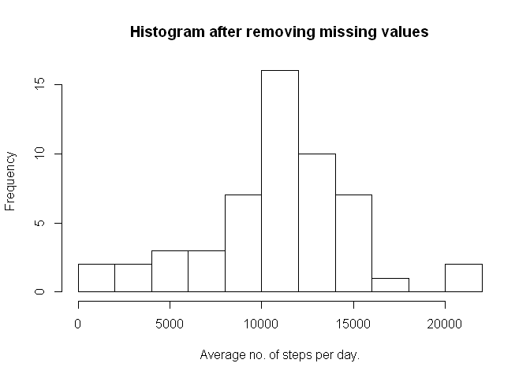
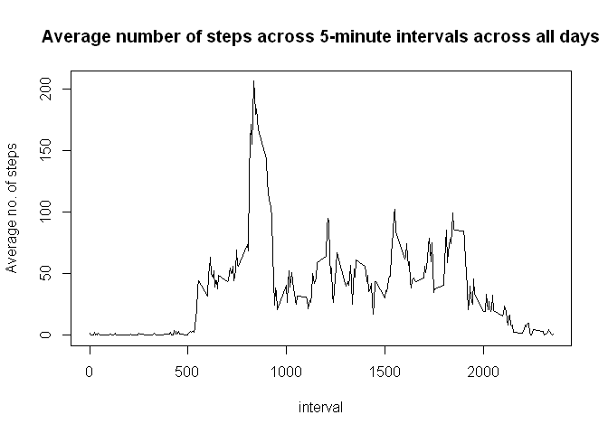
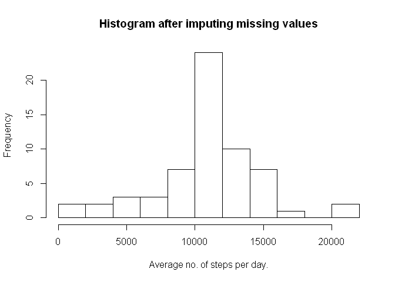
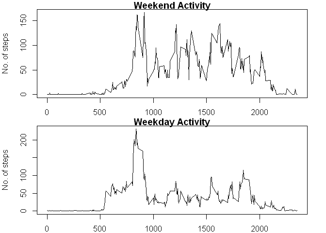

# Reproducible Research: Peer Assessment 1


# . 
# The aim was to use basic R functions instead of advanced packages.
# .


## Loading and preprocessing the data

Raw Activity Data is stored in ra variable


```r
setwd('c:/gh/repdata/RepData_PeerAssessment1')
ra<-read.csv('activity.csv',header=TRUE)
```

Make a backup on ra in memory


```r
ra2<-ra
```

Convert date character format into proper date format.


```r
ra$date<-as.Date(ra$date,"%Y-%m-%d")
```


Copy of the original dataset with date correct for use later in Imputing.

```r
rad<-ra2
rad$date<-as.Date(rad$date,"%Y-%m-%d")
```


## What is mean total number of steps taken per day?

To effectively calculate the mean, we need to remove the missing values.


```r
rm<-complete.cases(ra)
ram<-ra[rm,]
```

This groups the steps by date & then sums the steps of each date.


```r
rs<-tapply(ram$steps,ram$date,sum)
```


**1. Make a histogram of the total number of steps taken each day**

rs contains the total number of steps for each day. So we can plot the histogram and see what is the frequency distribution like.


```r
hist(rs,breaks=10,main="Histogram after removing missing values",xlab="Average no. of steps per day.")
```

 

**2. Calculate and report the mean and median total number of steps taken per day**


Mean of the total number of steps per day.


```r
mean(rs)
```

```
## [1] 10766.19
```

Median of the total number of steps per day


```r
median(rs)
```

```
## [1] 10765
```


## What is the average daily activity pattern?

**1. Make a time series plot (i.e. type = "l") of the 5-minute interval (x-axis) and the average number of steps taken, averaged across all days (y-axis)**


So each 5-minute interval has an identifier. What is the average of all the steps belonging to a particular interval identifier averaged across all the days.


We now group the steps by their interval across all days & then take the mean of the steps in that interval.


```r
ri<-tapply(ram$steps,ram$interval,mean)
```

This gives us the plot of the average number of steps per interval taken across all days.


```r
plot(names(ri),ri,type="l",main="Average number of steps across 5-minute intervals across all days",xlab="interval",ylab="Average no. of steps")
```

 


**2. Which 5-minute interval, on average across all the days in the dataset, contains the maximum number of steps?**

This corresponds to the 104th point in the plot i.e interval number 835 on the x-axis.


```r
which.max(ri)
```

```
## 835 
## 104
```

Also on average across all days, the maximum number of steps is:


```r
max(ri)
```

```
## [1] 206.1698
```


## Imputing missing values


**1. Calculate and report the total number of missing values in the dataset (i.e. the total number of rows with NAs)**


We take all the rows with missing values & add them up to get total number of missing values.


```r
sum(is.na(ra))
```

```
## [1] 2304
```


**2. Devise a strategy for filling in all of the missing values in the dataset. The strategy does not need to be sophisticated. For example, you could use the mean/median for that day, or the mean for that 5-minute interval, etc.**

Given the choice choose the strategy of the mean for that 5-minute interval average across all days.

First get the interval numbers of the missing steps.


```r
intervalnosofmissingsteps <- ra$interval[is.na(ra$steps)]
```

Second, get the row numbers of the missing steps.


```r
rownosofmissingsteps <- which(is.na(ra$steps))
```


**3. Create a new dataset that is equal to the original dataset but with the missing data filled in.**

Now match the row number of the missing steps to the interval number of the mean of that interval.


```r
ra$steps[rownosofmissingsteps]<-ri[as.character(intervalnosofmissingsteps)]
```


**4. Make a histogram of the total number of steps taken each day.** 


```r
rwm<-tapply(ra$steps,ra$date,sum)
hist(rwm,breaks=10,main="Histogram after imputing missing values",xlab="Average no. of steps per day.")
```

 


**Calculate and report the mean and median total number of steps taken per day. Do these values differ from the estimates from the first part of the assignment?** 

Mean of the total number of steps per day.
  

```r
mean(rwm)
```

```
## [1] 10766.19
```

Median of the total number of steps per day


```r
median(rwm)
```

```
## [1] 10766.19
```


**What is the impact of imputing missing data on the estimates of the total daily number of steps?**

Not dramatic. The median is shifted as there are more values now.

## Are there differences in activity patterns between weekdays and weekends?
**1. Create a new factor variable in the dataset with two levels -- "weekday" and "weekend" indicating whether a given date is a weekday or weekend day.**


```r
ra$weektype[weekdays(ra$date)=='Monday' | weekdays(ra$date)=='Tuesday' |weekdays(ra$date)=='Wednesday' |weekdays(ra$date)=='Thursday' |weekdays(ra$date)=='Friday']<- "weekday"
ra$weektype[weekdays(ra$date) =="Saturday" | weekdays(ra$date)=="Sunday"]<- "weekend"

ra$weektype<-factor(ra$weektype)
```

**2. Make a panel plot containing a time series plot (i.e. type = "l") of the 5-minute interval (x-axis) and the average number of steps taken, averaged across all weekday days or weekend days (y-axis). The plot should look something like the following, which was created using simulated data:**


```r
rweekday<-ra[ra$weektype=='weekday',]
rweekend<-ra[ra$weektype=='weekend',]

rwkd<-tapply(rweekday$steps,rweekday$interval,mean)
rwke<-tapply(rweekend$steps,rweekend$interval,mean)
```


###As seen below, on average there are more number of steps on weekends.
1. People wake up later during weekends.
2. During weekday all walking activity stops early as people reach office,schools etc...
3. During weekends walking activity continues as people keep traveling.


```r
par(mfrow=c(2,1),mar=c(2, 4, 1, 2))

plot(names(rwke),rwke,type='l',main="Weekend Activity",xlab="interval",ylab="No. of steps")
plot(names(rwkd),rwkd,type='l',main="Weekday Activity",xlab="interval",ylab="No. of steps")
```

 


